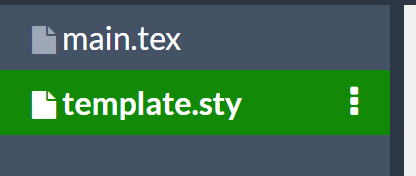
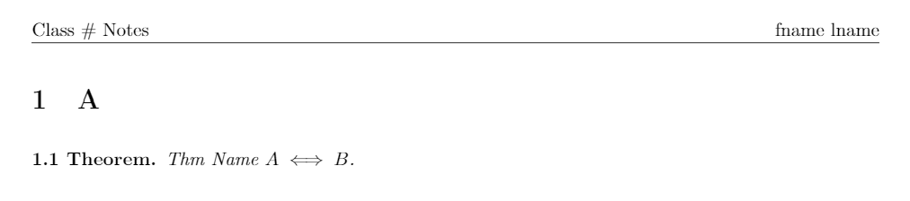
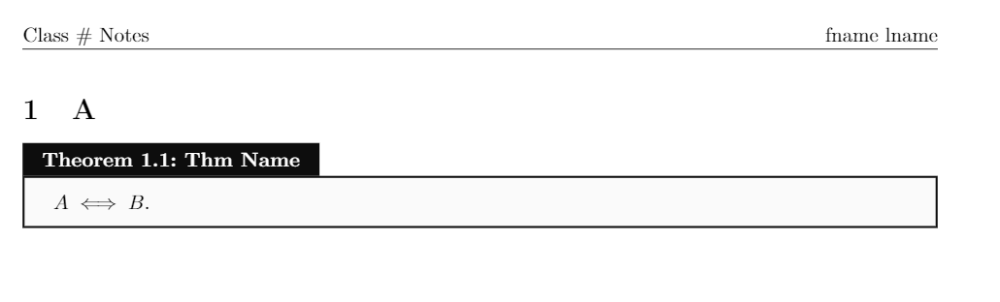
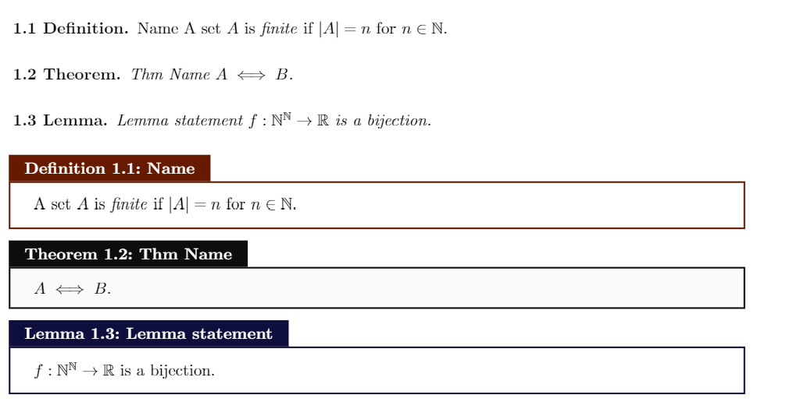
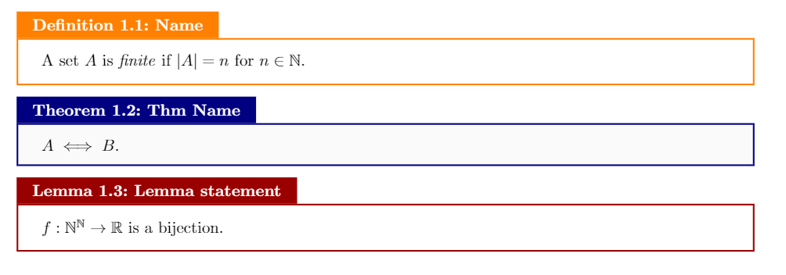
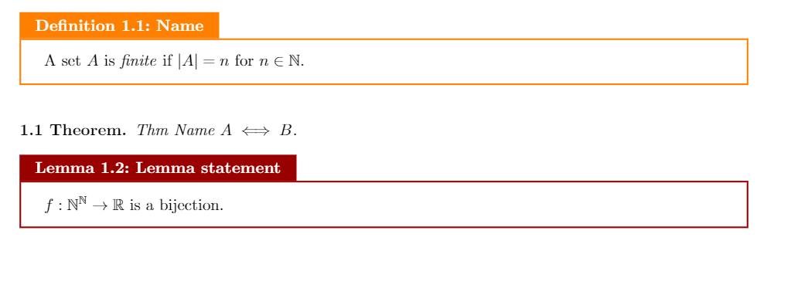

# Using the Template
1. Copy the [`template.sty`](./template.sty) in your folder with the `.tex` file. 


2. Add this to the preamble of your `.tex` file.
```tex
\usepackage[
	name=fname\ lname, 
	class= Class \ \#, 
	doctype= Notes, 
	boxed=false,] 
{template}
```
The file should look likt the [`main.tex`](./main.tex) file. Fill your first name / last name, class, type of doc and `true/false` for boxed. 

## Sample output
1. boxed = false the output is (*file*: [`main.tex`](./main.tex) )

2. boxed = true the output is



## Theorem / Lemma / Definition
Currently there are 3 built in enviroments. 
```tex
\begin{defn}{Name}
A set $A$ is \textit{finite} if $|A| = n$ for $n\in \mathbb{N}$. 
\end{defn}

\begin{thm}{Thm Name}
$A \iff B$. 
\end{thm}

\begin{lemma}{Lemma statement}
$f : \mathbb{N}^\mathbb{N} \to \mathbb{R}$ is a bijection. 
\end{lemma}
```
The output for boxed = true / false is: 


## Other options
1. **Light/Bright mode**: To switch to brighter color boxes use the boxedlight=true option in the package import. 
```tex
\usepackage[
	name=fname\ lname, 
	class= Class \ \#, 
	doctype= Notes, 
	boxed=true,
	boxedlight=true] 
{template}
```


### Overriding boxed theorem
In boxed=false mode you can override the boxed setting by using the `bthm`, `blemma` and `bdefn` enviroment. 
```tex
% boxed = false, boxedlight = true
\begin{bdefn}{Name}
A set $A$ is \textit{finite} if $|A| = n$ for $n\in \mathbb{N}$. 
\end{bdefn}

\begin{thm}{Thm Name}
$A \iff B$. 
\end{thm}

\begin{blemma}{Lemma statement}
$f : \mathbb{N}^\mathbb{N} \to \mathbb{R}$ is a bijection. 
\end{blemma}
```
This will put the definition and lemma in boxes but not the theorem. 


## Colors
Currently there is no way to change the colors from the `.tex` file you can edit these lines in the style file to get custom colors: 

```
% Box Thm Colors
\definecolor{defncol}{HTML}{661a00} 
\definecolor{thmcol}{HTML}{0d0d0d} 
\definecolor{lemmcol}{HTML}{0f0f3d} 
```
For changing lightmode colors 
```
\ifMCS@boxedlight
\definecolor{defncol}{HTML}{FF8000} 
\definecolor{thmcol}{HTML}{000080} 
\definecolor{lemmcol}{HTML}{990000} 
\fi
```